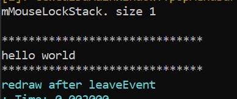
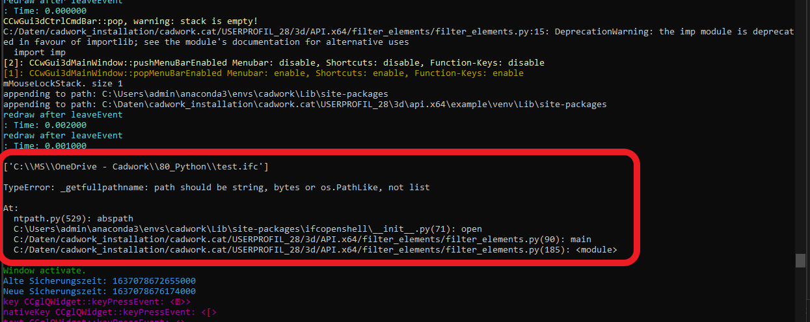
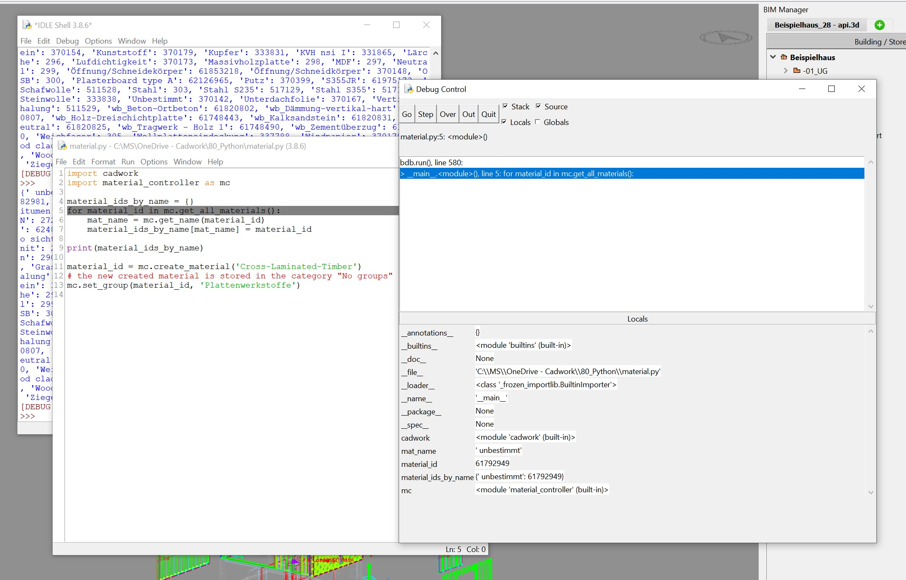

---
hide:
  - toc
---

**Debugging python script in cadwork**<br>
This section refers to calling the plugins from the Plugin Bar.
If you want to debug a script in cadwork, then you can enable the console in User Test in the user settings. When cadwork is restarted, the console opens.
In the console you will see the screen output or errors.

User Test -> Userprofile -> Test Options... -> Console

<figure markdown="1">
{width=700}
</figure>

## Console

Bugs present in the script can be detected in the console.

Any print statements are also visible in the console.

```python
print("hello world")
```

Print output in console:

<figure markdown="1">
{width=300}
</figure>

Displayed Bug in console:

<figure markdown="1">
{width=800}
</figure>

or use the debugger from Python IDLE.

<figure markdown="1">
{width=700}
</figure>

# Pycharm Professional

## Remote debugging with the Python remote debug server configuration

[Pycharm debug server configuration :bulb:](https://www.jetbrains.com/help/pycharm/remote-debugging-with-product.html#remote-debug-config)

- Install the pydevd-pycharm package on the remote machine by running the following command:

  pip install pydevd-pycharm~=<version of PyCharm on the local machine>

  for example, pip install pydevd-pycharm~=191.3490)

- Modify the source code file as follows:

```python

import math
# ==============this code added==================================================================:
import pydevd_pycharm

pydevd_pycharm.settrace('172.20.208.95', port=12345, stdoutToServer=True,
                        stderrToServer=True)


# ================================================================================================
class Solver:

    def demo(self, a, b, c):
        d = b ** 2 - 4 * a * c
        if d > 0:
            disc = math.sqrt(d)
            root1 = (-b + disc) / (2 * a)
            root2 = (-b - disc) / (2 * a)
            return root1, root2
        elif d == 0:
            return -b / (2 * a)
        else:
            return "This equation has no roots"


if __name__ == '__main__':
    solver = Solver()

while True:
    a = int(input("a: "))
    b = int(input("b: "))
    c = int(input("c: "))
    result = solver.demo(a, b, c)
    print(result)


```

