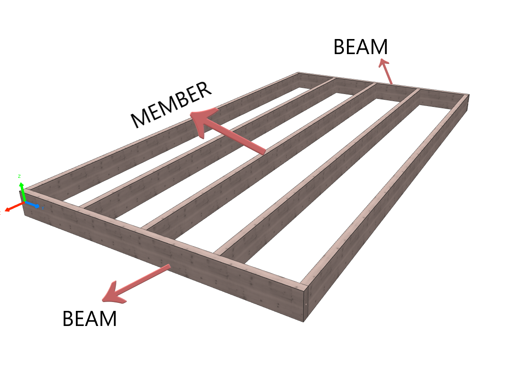

## Create a frame (construction)

{: style="width:700px"}

```python
"""creates a simple framed slab in cadwork...."""

# import modules
import      cadwork
import      attribute_controller       as ac
import      element_controller         as ec
import      geometry_controller        as gc
import      utility_controller         as uc
import      visualization_controller   as vc

# global variables
WIDTH           = 60.           # beam width
HEIGHT          = 240.          # beam height
ORIGIN          = 0., 0., 0.    # start/origin point
DIVISION        = 5             # number of divsion -> distribution (beam distribution)
BEAM_LENGTH     = 3600.         # length (beam)
MEMBER_LENGTH   = 5000.         # length (member)


def main():
    """ main function that creates a simple frame"""
    
    global ORIGIN
    global BEAM_LENGTH
    global MEMBER_LENGTH
    global WIDTH
    
    beam_length = BEAM_LENGTH # uc.get_user_double('Input beam length')
    
    # create start beam of frame
    beam_1 = create_beam(beam_length, 
                        cadwork.point_3d(*ORIGIN), 
                        cadwork.point_3d(0., 1., 0.), 
                        cadwork.point_3d(0., 0., 1.), 
                        'beam')
    
    # get vectors (beam_1)
    x_dir_beam, y_dir_beam, z_dir_beam = get_beam_vectors(beam_1)
    
    # move cadwork point -> start point for beam_2 (Kopfholz)
    start_point_beam_2 = cadwork.point_3d(*ORIGIN) + y_dir_beam * (MEMBER_LENGTH + WIDTH)
    
    # create end beam of frame
    beam_2 = create_beam(beam_length, 
                        start_point_beam_2, 
                        cadwork.point_3d(0., 1., 0.), 
                        cadwork.point_3d(0., 0., 1.), 
                        'beam')
    
    # move cadwork point -> start point for members
    start_point_member = cadwork.point_3d(*ORIGIN) + y_dir_beam * .5 * WIDTH \
                        + cadwork.point_3d(*ORIGIN) + x_dir_beam * .5 * WIDTH
    
    global DIVISION
    # calculate division distance
    spacing = beam_spacing(beam_1, DIVISION)
    
    members = []
    # while loop to create members -> increase spacing division
    n = 0.
    while n <= beam_length:
        member = create_beam(MEMBER_LENGTH, 
                            start_point_member + 
                            x_dir_beam * n, y_dir_beam, 
                            z_dir_beam)
        members.append(member)
        n += spacing
    
    # assign subgroup name to created elements 
    subgroup_name = ac.set_subgroup([beam_1, beam_2, *members], 'frame')
        
    return

#---------------------------------------------------------------

def create_beam(length, p1, x_dir, z_dir, name='member', color=3):
    """Creates a rectangular member with attributes: name, color

    Parameters
    ----------
    length : int
        beam length
    p1 : point_3d
        start point x, y, z
    x_dir : point_3d
        local x-vector x, y, z e.g. -> cadwork.point_3d(0., 1., 0.)
    z_dir : point_3d
        local z-vector x, y, z e.g. -> cadwork.point_3d(1., 0., 0.)
    name : str, optional
        set a name -> default = beam

    Returns
    -------
    int
        returns cadwork element ID
    """
    global WIDTH
    global HEIGHT
    beam = ec.create_rectangular_beam_vectors(WIDTH, HEIGHT, 
                                              length, 
                                              p1, 
                                              x_dir, 
                                              z_dir)
    ac.set_name([beam], name)
    vc.set_color([beam], color)
    
    return beam


def get_beam_vectors(element_id):
    """Returns vectors (x,y,z) 

    Parameters
    ----------
    element_id : int
        cadwork element id
        
    Returns
    -------
    point_3d
        returns cadwork point_3d / vectors
    """
    x_dir_sill = gc.get_xl(element_id)
    y_dir_sill = gc.get_yl(element_id)
    z_dir_sill = gc.get_zl(element_id)
    
    return x_dir_sill, y_dir_sill, z_dir_sill


def beam_spacing(beam, subdivisions):
    """Calculates the beam/member spacing

    Parameters
    ----------
    element_id : int
        cadwork element id
    
    subdivisions: int
        number of divisions
        
    Returns
    -------
    float
        returns divison length
    """
    global WIDTH
    beam_length = gc.get_length(beam)
    distance = (beam_length - WIDTH) / subdivisions
    
    return distance
    
    
#---------------------------------------------------------------

if __name__ == '__main__':
    main()
    

```
