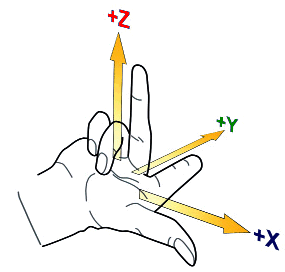
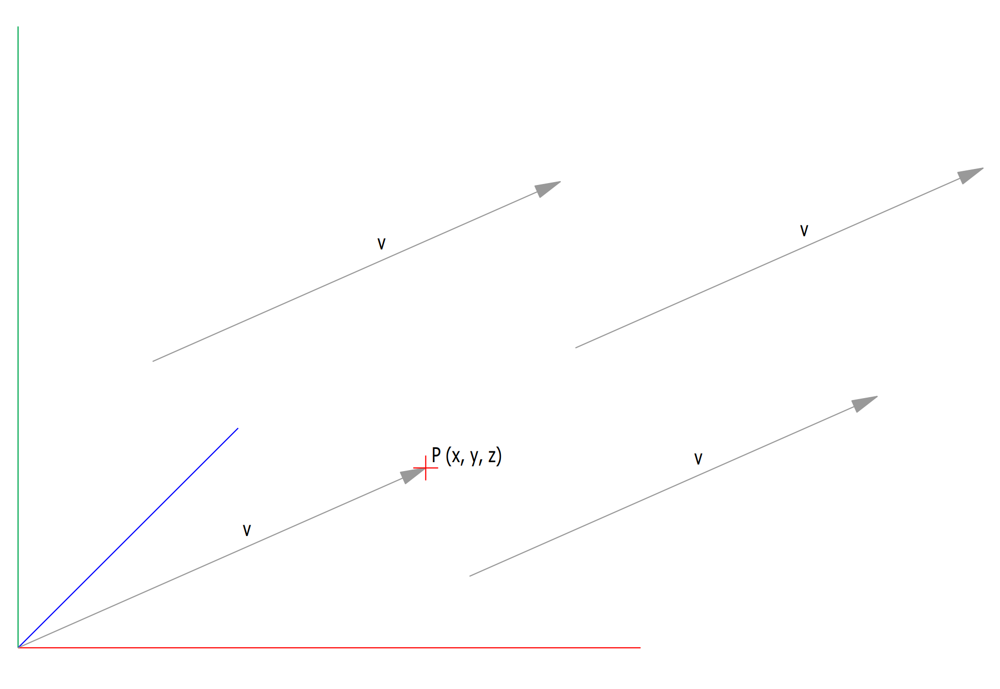
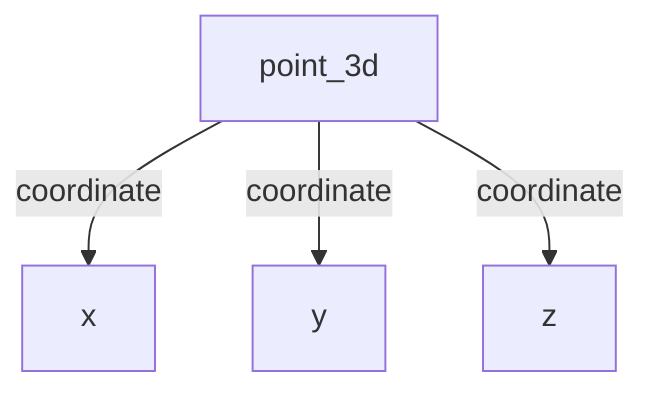
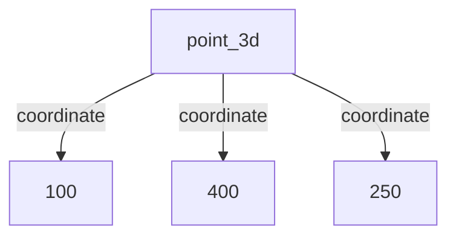
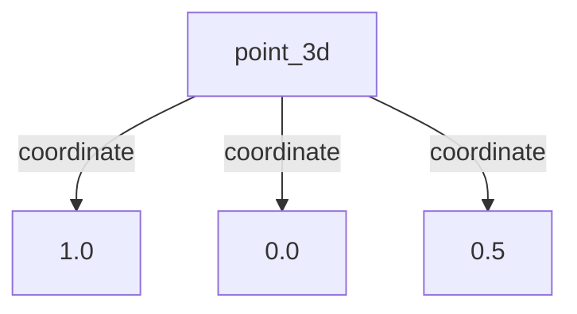
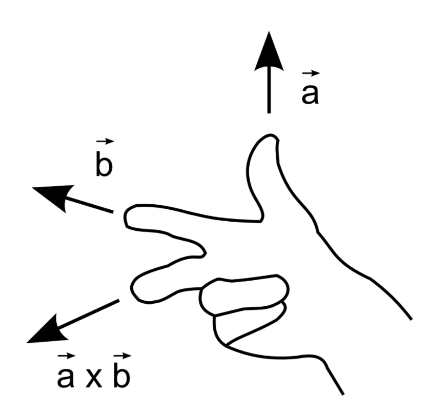

---
hide:
  - toc
---

# Geometry

**Coordinates in cadwork** <br>
To be able to determine the directions of the axes and the order of the x, y and z axes, the right-hand rule is applied:
Spread the first three fingers of your right hand, as seen below. By virtue of the right-hand rule, your thumb becomes the positive x axis, the index finger, which is at a right angle from the thumb, becomes the positive y axis and the middle finger becomes the z axis. The position of the middle finger is of decisive importance. It points in the positive z direction. No matter how you rotate your right hand, the positive direction of the z axis is determined by the right-hand rule.

<figure markdown="1">
{width=300}
</figure>

**Base of cadwork elements** <br>
All basic elements in cadwork have an axis system. Except for the auxiliary element, room and surfaces, the elements are defined by an axis. The axis spans between point 1 and point 2.
The orientation of the axis is defined by the vectors x, y, z.

<figure markdown="1">
{width=500}
</figure>

## Vector Geometry

A vector indicates a quantity, such as velocity or force, that has direction and length.Vectors in 3D coordinate systems are represented with an ordered set of three realnumbers.

Two vectors are the same if they have the same magnitude and direction. This means that if we take a vector and translate it to a new position (without rotating it),
then the vector we obtain at the end of this process is the same vector we had in the beginning.

**Vector or point**<br>
A vector defines a direction and length. A point defines a location.

<figure markdown="1">
{width=600}
</figure>

### Cadwork Points and Vectors







A cadwork point_3d list can be accessed like a simple python list.

```python hl_lines="5 6 7"
import cadwork  # import module

point = cadwork.point_3d(100, 200, 300)  # create a cadwork Point

print(point[0])  # prints x coordinate
print(point[1])  # prints y coordinate
print(point[2])  # prints z coordinate
```

The coordinates of a cadwork point_3d object can also be accessed by its .x, .y and .z attributes.

```python hl_lines="5 6 7"
import cadwork  # import module

point = cadwork.point_3d(100, 200, 300)  # create a cadwork Point

print(point.x)  # prints x coordinate
print(point.y)  # prints y coordinate
print(point.z)  # prints z coordinate
```

### point_3d Methods

```python 
point_3d + point_3d
point_3d - point_3d
point_3d * float
point_3d / float
point_3d += point_3d
point_3d -= point_3d
point_3d *= float
point_3d /= float
-point_3d
point_3d == point_3d
point_3d != point_3d
point_3d.dot(point_3d)  # dot product or scalar product
point_3d.cross(point_3d)  # cross product or vector product 
point_3d.magnitude()  # vector magnitude or length
point_3d.normalized()  # a normalized vector maintains its direction but its length becomes 1
point_3d.distance(point_3d)  # distance between two points
```

### move a cadwork point

<figure markdown="1">
{width=300}
</figure>

```python 
import cadwork  # import module

vector_x = cadwork.point_3d(1., 0., 0.)  # define vector
distance = 1500.0  # moving distance

moved_point = point + (vector_x * distance)    
```

### cross product

<figure markdown="1">
{width=200}
</figure>

```python
import cadwork

a = cadwork.point_3d(1., 0., 0.)
b = cadwork.point_3d(0., 1., 0.)

ab = a.cross(b)
# ab = [0.000000, 0.000000, 1.000000]
```

### Angle Between Two 3D Vectors

$$
\cos \theta = \frac{\vec{u} \cdot \vec{v}}{|\vec{u}| \times |\vec{v}|}
$$

```python
import math as m  # import module 
import cadwork as cw


def angle_between_vectors(v1: cw.point_3d, v2: cw.point_3d) -> float:
    return m.acos(v1.dot(v2) / (v1.magnitude() * v2.magnitude())) * (180 / m.pi)
``` 

