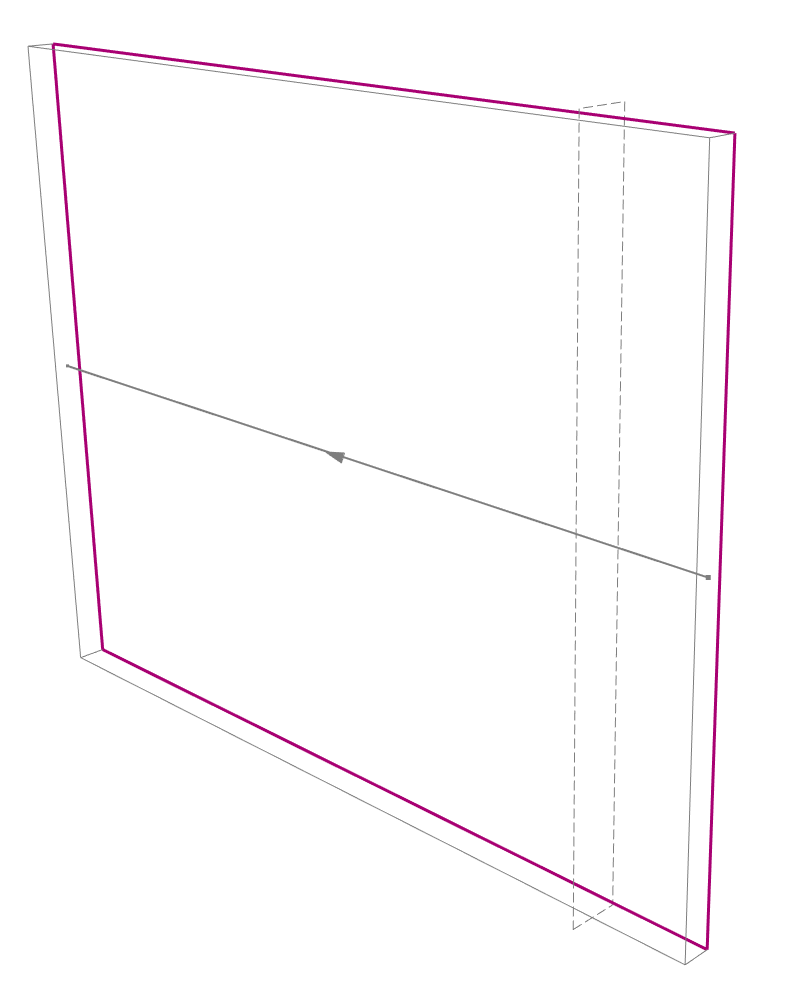

---
hide:
  - toc
---

# shop_drawing_controller
## export 2d wireframe drawing from current view

```python
import cadwork
import shop_drawing_controller as sdc

clipboard_number = 3
with_layout = False  # boolean to export with or without layout

sdc.export_2d_wireframe_with_clipboard(clipboard_number, with_layout)
```

## export 2d wireframe drawing from current view

```python
import attribute_controller as ac
import cadwork
import geometry_controller as gc
import element_controller as ec
import shop_drawing_controller as sdc

element_id = ec.get_user_element_ids()
if len(element_id) != 1:
    uc.print_error('Please select just one wall element')
    exit()
if not ac.is_wall(*element_id):
    uc.print_error('Please select a wall element')
    exit()

position_vector = gc.get_p1(*element_id)
position_vector += gc.get_xl(*element_id) * 500.0


sdc.add_wall_section_vertical(*element_id, position_vector)
```
{: style="width:600px"}

## horizontal wall section at a picked point

```python
import attribute_controller as ac
import cadwork
import element_controller as ec
import shop_drawing_controller as sdc
import utility_controller as uc

wall_ids = [element_id for element_id in ec.get_active_identifiable_element_ids() if ac.is_wall(element_id)]
if not wall_ids:
    uc.print_error('Please activate at least one wall')
    raise SystemExit

section_point = uc.get_user_point()
for wall_id in wall_ids:
    sdc.add_wall_section_horizontal(wall_id, section_point)
```

## piece-by-piece export with saved settings

```python
import element_controller as ec
import shop_drawing_controller as sdc

settings_file = r'C:\cadwork\settings\piece_by_piece.ini'
clipboard_number = 5

sdc.load_export_piece_by_piece_settings(settings_file)
sdc.export_piece_by_piece_with_clipboard(clipboard_number, ec.get_active_identifiable_element_ids())
```

## hidden-lines export to a 2dc file

```python
import os

import shop_drawing_controller as sdc
import utility_controller as uc

base_name = os.path.splitext(uc.get_3d_file_name())[0]
file_path = os.path.join(uc.get_user_path_from_dialog(), f'{base_name}_hidden_lines.2dc')

sdc.export_2d_hidden_lines_with_2dc(file_path, True)
```
