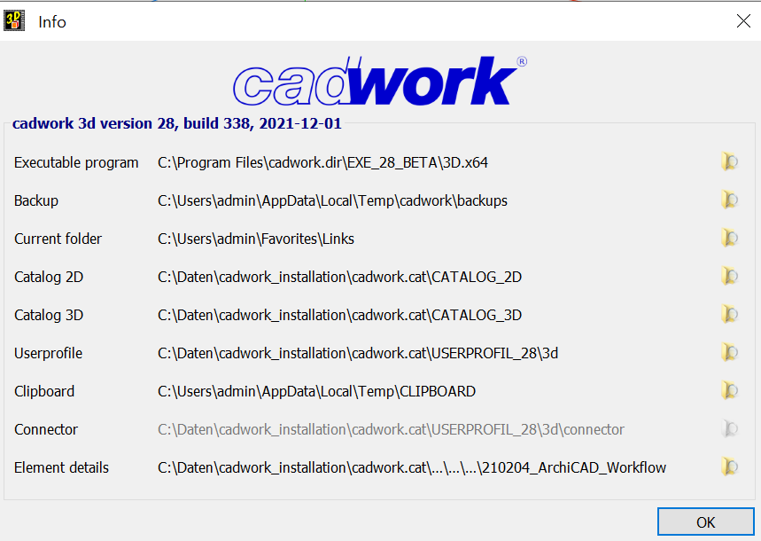
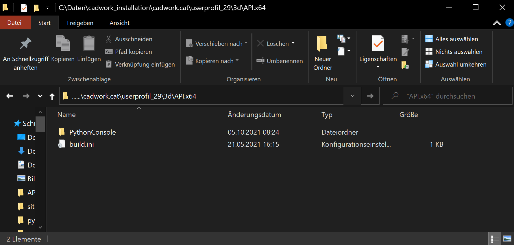
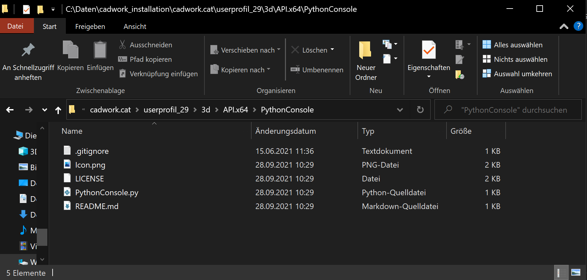

---
hide:
  - toc
---

# Setup Python in Cadwork

To use Python scripts in cadwork, they must be located in the userprofile in the folder api.x64.

Click in a 3D file on **Help** --> **Info** and open the folder named **Userprofile** which brings you to the api.x64 directory.

<figure markdown="1">
{width=600}
</figure>

A folder must be created in the api.x64 directory for each script. The Python script must have the same name as the folder so that it can be executed.

<figure markdown="1">
{width=600}
</figure>

<figure markdown="1">
{width=600}
</figure>

Once you have placed a folder and a script in the directory, you can start a cadwork 3D file.

Now show the plugin bar (Window -> Plugins). For the moment you see a button with the name of the plugin/script folder.

Instead of this name you can place an icon in the api.x64 folder under the plugin directory.

!!! important "Scripts that should be callable from the plugin bar must be placed in the folder<br> ..\userprofile_28\3d\API.x64. <br>A folder must be created in this directory. The name of the folder must have the same name as the script."

    * ..\userprofile_28\3d\API.x64 (Directory)
        * MyFirstScript (Folder)
            * MyFirstScript.py (Python File)
            * Icon.png (Plugin Icon, size ~30x30 pixel)

### add a plugin icon

You can add an icon, which will be displayed in the plugin bar.
Just add an PNG or SVG File into the API directory c:\users\public\documents\cadwork\userprofil_27\API.x64\PythonConsole. The file must have the following name **Icon.png or Icon.svg** . The icon should be scaled down to 30x30 pixels.

### Plugin Info

For the plugins you can add a description. To do this, you can use the following xml file and customize and extend it according to your needs.
Save the XML file under the name plugin_info.xml in the directory of your plugin.
The plugin info is then displayed as soon as the mouse pointer is hovered over the icon.

<figure markdown="1">
{width=500}
</figure>

#### plugin_info.xml

```xml
<?xml version="1.0" encoding="UTF-8"?>
<PluginInfo>
    <Version>1.0.0.0</Version>
    <Date>2022-04-12</Date>
    <Author>your Name</Author>
    <Name>
        <Text language="German">Plugin Title - foo bar baz</Text>
        <Text language="English">Plugin Title - foo bar baz</Text>
        <Text language="French">Plugin Title - foo bar baz</Text>
        <Text language="Italian"/>
        <Text language="Spanish"/>
        <Text language="Czech"/>
        <Text language="Finnish"/>
        <Text language="Russian"/>
        <Text language="Polish"/>
        <Text language="Romanian"/>
        <Text language="Norwegian"/>
        <Text language="Chinese"/>
        <Text language="Portuguese"/>
        <Text language="Estonian"/>
        <Text language="Japanese"/>
    </Name>
    <Description>
        <Text language="German">
            <![CDATA[
Hallo Welt... Plugin Beschreibung
]]>
        </Text>
        <Text language="English">
            <![CDATA[
Hello World... Plugin Description
]]>
        </Text>
        <Text language="French">
            <![CDATA[
Bonjour le monde... Description du plugin
]]>
        </Text>
        <Text language="Italian"/>
        <Text language="Spanish"/>
        <Text language="Czech"/>
        <Text language="Finnish"/>
        <Text language="Russian"/>
        <Text language="Polish"/>
        <Text language="Romanian"/>
        <Text language="Norwegian"/>
        <Text language="Chinese"/>
        <Text language="Portuguese"/>
        <Text language="Estonian"/>
        <Text language="Japanese"/>
    </Description>
</PluginInfo>
```

## easy start with Python IDLE :bulb:

IDLE is Python’s Integrated Development and Learning Environment.

The IDLE allows you to run Python scripts directly in cadwork.

IDLE has the following features:

* coded in 100% pure Python, using the tkinter GUI toolkit
* cross-platform: works mostly the same on Windows, Unix, and macOS
* Python shell window (interactive interpreter) with colorizing of code input, output, and error messages
* multi-window text editor with multiple undo, Python colorizing, smart indent, call tips, auto completion, and other features
* search within any window, replace within editor windows, and search through multiple files (grep)
* debugger with persistent breakpoints, stepping, and viewing of global and local namespaces
  configuration, browsers, and other dialogs

Menus
IDLE has two main window types, the Shell window and the Editor window. It is possible to have multiple editor windows simultaneously. On Windows and Linux, each has its own top menu. Each menu documented below indicates which window type it is associated with.
Output windows, such as used for Edit => Find in Files, are a subtype of editor window. They currently have the same top menu but a different default title and context menu.
On macOS, there is one application menu. It dynamically changes according to the window currently selected. It has an IDLE menu, and some entries described below are moved around to conform to Apple guidelines.

### download / clone IDLE in cadwork userprofile

Go to [GitHub - Cadwork](https://github.com/CadworkMontreal/PythonConsole) -> click on Button **Code** and clone or Download ZIP into your directory -> c:\users\public\documents\cadwork\userprofil_28\API.x64\PythonConsole'.

<figure markdown="1">
{width=800}
</figure>

### run Code

Open cadwork 3D and open the Python Console (IDLE) from the plugin bar.

Save your .py script and press ++f5++ or go via Menu -> Run -> Run Module

<figure markdown="1">
{width=800}
</figure>

Example Code:

```python
# import modules
import cadwork
import element_controller as ec
import attribute_controller as ac

# get active element_ids
element_ids = ec.get_active_identifiable_element_ids()

for element_id in element_ids:
    subgroup = ac.get_subgroup(element_id)  # get subgroup name of active element_ids
    print(subgroup)  # print the subgroup names
```

### run plugin from console

You can also run the plugin from the console.
Flag ```/PLUGIN=``` is used to start the plugin.

```cmd
...\cadwork.dir\ci_start.exe "C:\...\myFile.3d" /PLUGIN=test
```

## Use your prefered IDE (advanced user)

Of course, you can also use any other Python IDE.
For this purpose e.g. PyCharm is recommended.
Install the CWAPI3D package into your environment via ```pip install cwapi3d```. Open your IDE and start with your script.
Install a specific version ```pip install <PACKAGE>==<VERSION>```

### Python version used in cadwork :bulb:  <br>

Cadwork uses CPython version 3.9.10

### Install CWAPI3D package on your device

```bash
pip install cwapi3d
```

[Github - cwapi3d python](https://github.com/cwapi3d/cwapi3dpython){target=_blank}

[PyPi Python Package](https://pypi.org/project/cwapi3d/){target=_blank}

The script cannot be run from the IDE (PyCharm, VS Code, ...). The script call must be made in cadwork (Plugin Bar).

[Example Video - How to Python in cadwork](videos.md#Videos) :tv: <br>


