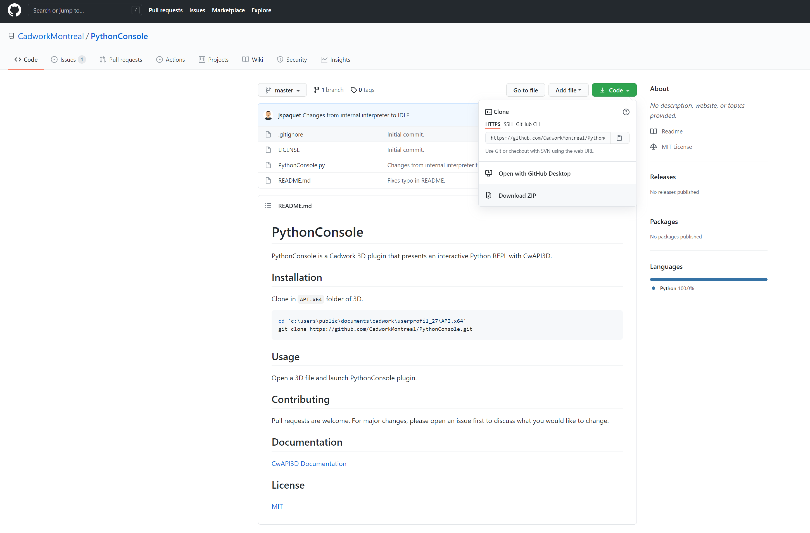
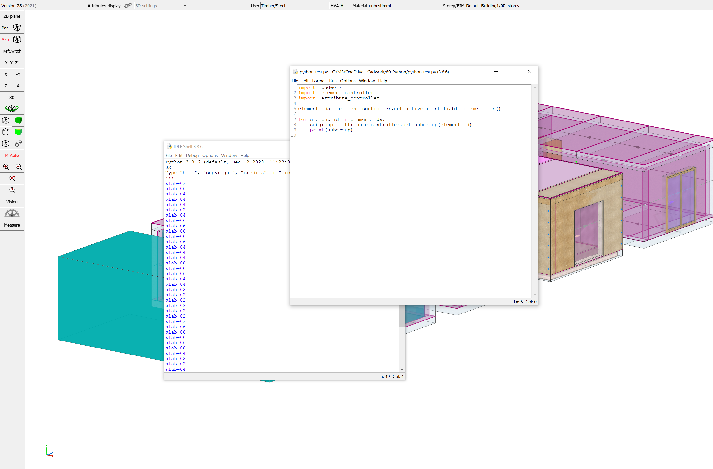

# cadwork Python Guide  {: style="width:30px"}

In front of you, you see the first version of the cadwork Python Guide. 
This document is written in cooperation of the cadwork branches. 
Since version 27 cadwork offers an API connection to the script language Python. 
By scripting in cadwork with Python you can automate and customize your operations. 

The API provides a multitude of basic functions of cadwork 3D. On the basis of the API external programs can be written, with which it is possible to e.g. create and manipulate parts. 
List calculations, list outputs, various import and export functions and much more is available via the API. This allows the implementation of customer specific functions without changing the program code of cadwork. By using the API, a wide range of helpers for various areas can be created and directly integrated into cadwork 3D. Cadwork itself delivers some of these small helpers by default. But also the development of small and large helpers by you as a user is possible.

The Python Guide should enable you to start scripting in cadwork 3D. 
I hope we could convince you of the great potential with Python in cadwork. 


## Introduction

### what is an API?
An application programming interface (API) is a connection between computers or between computer programs. It is a type of software interface, offering a service to other pieces of software. A document or standard that describes how to build such a connection or interface is called an API specification. A computer system that meets this standard is said to implement or expose an API. The term API may refer either to the specification or to the implementation.

{: style="width:700px"}


### Why Python?  

* Python is easy to learn. Its syntax is easy and code is very readable.
* Python has a lot of applications. It's used for developing web applications, data science, rapid application development, and so on.
* Python allows you to write programs in fewer lines of code than most of the programming languages.
* The popularity of Python is growing rapidly. Now it's one of the most popular programming languages.

### What is Python?  

Python is an interpreted, object-oriented, high-level programming language with dynamic semantics. Its high-level built in data structures, combined with dynamic typing and dynamic binding, make it very attractive for Rapid Application Development, as well as for use as a scripting or glue language to connect existing components together. Python's simple, easy to learn syntax emphasizes readability and therefore reduces the cost of program maintenance. Python supports modules and packages, which encourages program modularity and code reuse. The Python interpreter and the extensive standard library are available in source or binary form without charge for all major platforms, and can be freely distributed.

Often, programmers fall in love with Python because of the increased productivity it provides. Since there is no compilation step, the edit-test-debug cycle is incredibly fast. Debugging Python programs is easy: a bug or bad input will never cause a segmentation fault. Instead, when the interpreter discovers an error, it raises an exception. When the program doesn't catch the exception, the interpreter prints a stack trace. A source level debugger allows inspection of local and global variables, evaluation of arbitrary expressions, setting breakpoints, stepping through the code a line at a time, and so on. The debugger is written in Python itself, testifying to Python's introspective power. On the other hand, often the quickest way to debug a program is to add a few print statements to the source: the fast edit-test-debug cycle makes this simple approach very effective.[^1]
[^1]: [python](https://www.python.org/doc/essays/blurb/)

```python
print("Hello cadwork World, let's get started!")
```


Python provides some built-in data types, in particular, [dict](https://docs.python.org/3/library/stdtypes.html#dict){target=_blank}, [list](https://docs.python.org/3/library/stdtypes.html#list){target=_blank}, [set and frozenset](https://docs.python.org/3/library/stdtypes.html#set){target=_blank}, and [tuple](https://docs.python.org/3/library/stdtypes.html#tuple){target=_blank}. The [str](https://docs.python.org/3/library/stdtypes.html#str){target=_blank} class is used to hold Unicode strings, and the [bytes](https://docs.python.org/3/library/stdtypes.html#bytes){target=_blank} and [bytearray](https://docs.python.org/3/library/stdtypes.html#bytearray){target=_blank} classes are used to hold binary data.[^2]
[^2]: [data types](https://docs.python.org/3/library/datatypes.html)

If you are unfamiliar with Python and still want to write helper scripts, I recommend doing a tutorial and then come back to cadwork. :woman_student: <br>

* [The Python Tutorial](https://docs.python.org/3.4/tutorial/){target=_blank}
* [LearnPython](https://www.learnpython.org/){target=_blank}
* [RealPython](https://realpython.com/){target=_blank}


## Python in cadwork :bulb:  <br>
Cadwork uses CPython version 3.8.6 


**The Easiest Way to Run Python in cadwork**<br>
Python's default IDLE

We can use any text editing software to write a Python script file.
We just need to save it with the .py extension. But using an IDE can make our life a lot easier. IDE is a piece of software that provides useful features like code hinting, syntax highlighting and checking, file explorers, etc. to the programmer for application development.
By the way, when you install Python, an IDE named IDLE is also installed. You can use it to run Python on your computer. It's a decent IDE for beginners. Exactly this IDE we can also use directly in cadwork 3D. 
To add the IDE you can [clone](https://docs.github.com/en/github/creating-cloning-and-archiving-repositories/cloning-a-repository-from-github/cloning-a-repository){target=_blank} the files from [PythonConsole](https://github.com/CadworkMontreal/PythonConsole){target=_blank} into your API.x64 folder. Or download the zip folder and unzip the files in the user profile API.x64

{: style="width:700px"}

If you use the IDLE as described above in cadwork, then the IDE can be started directly from cadwork (click on the PythonConsole Button). Now you can start with your first scripts. 

{: style="width:700px"}


{: style="width:700px"}


```python
# import modules
import  cadwork   
import  element_controller      as ec
import  attribute_controller    as ac

# get active element_ids
element_ids = ec.get_active_identifiable_element_ids()

for element_id in element_ids:
    subgroup = ac.get_subgroup(element_id) # get subgroup name of active element_ids
    print(subgroup) # print the subgroup names
```


**File storage Plguins :file_folder:**  <br>

Of course, you can also use any other Python IDE. 
For this purpose e.g. PyCharm is recommended. 
Install the CWAPI3D package into your environment via ```pip install cwapi3d```. Open your IDE and start with your script.
To run the script in cadwork you have to set it up as described below. 
The script cannot be run in the IDE. The script call must be made in cadwork. 

[Example Video - How to](example.md#Videos) <br>
!!! important "Scripts that should be callable from the plugin bar must be placed in the folder<br> ..\userprofile_28\3d\API.x64. <br>A folder must be created in this directory. The name of the folder must have the same name as the script."
    
    * ..\userprofile_28\3d\API.x64 (Directory)
        * MyFirstScript (Folder)
            * MyFirstScript.py (Python File)
            * Icon.png (Plugin Icon, size ~30x30 pixel)


**Debugging python script in cadwork**<br>
This section refers to calling the plugins from the Plugin Bar.
If you want to debug a script in cadwork, then you can enable the console in User Test in the user settings. When cadwork is restarted, the console opens. 
In the console you will see the screen output (print('hello world'), or errors. 

User Test -> Userprofile -> Test Options... -> Console


{: style="width:900px"}


**Coordinates in cadwork** <br>
To be able to determine the directions of the axes and the order of the x, y and z axes, the right-hand rule is applied:
Spread the first three fingers of your right hand, as seen below. By virtue of the right-hand rule, your thumb becomes the positive x axis, the index finger, which is at a right angle from the thumb, becomes the positive y axis and the middle finger becomes the z axis. The position of the middle finger is of decisive importance. It points in the positive z direction. No matter how you rotate your right hand, the positive direction of the z axis is determined by the right-hand rule.

{: style="width:300px"}


**Base of cadwork elements** <br>
All basic elements in cadwork have an axis system. Except for the auxiliary element, room and surfaces, the elements are defined by an axis. The axis spans between point 1 and point 2. 
The orientation of the axis is defined by the vectors x, y, z. 

{: style="width:700px"}

**Import packages** <br>
As CPython is used in cadwork, it is possible to work with external modules. The modules included in Python as standard can be integrated normally by loading the modules. 

```python
# import modules
import  cadwork  
import  math
import  csv
import  tkinter
...
...
```

**Import external packages** <br>
```python
# import modules
import  sys                                 
import  utility_controller as uc

USERPROFIL = uc.get_3d_userprofil_path()   # get userprofil path

paths = [(USERPROFIL + '\\api.x64\\FolderName\\PackageFolder'),
        ("C:\\Program Files\\cadwork.dir\\EXE_28\\Pclib.x64\\python38\\site-packages")
          ]

for path in paths:
    if path not in sys.path:
        sys.path.append(path)

# import external modules
import external_package1                    
import external_package2
import external_package3

```