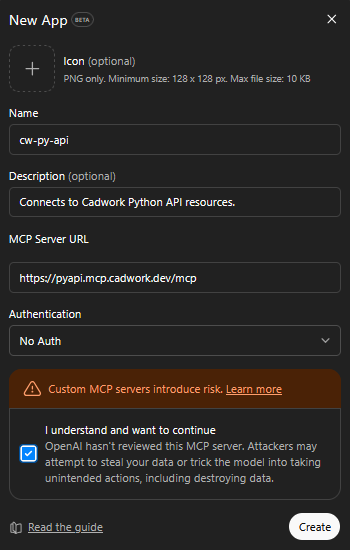

---
hide:
  - navigation
  - toc
---

# {: style="height: 32px; vertical-align: middle;" } MCP Cadwork Python API Server

**MCP URL:** `https://cadwork-mcp-pyapi.com/mcp`

## What is MCP?

The **Model Context Protocol (MCP)** is an open standard that enables AI assistants to securely connect to external context. Think of it as a bridge that allows AI models to access real-time, specialized information beyond their training data.

When you connect an AI assistant to an MCP server, it gains the ability to query that server for relevant context, making responses more accurate and up-to-date.

## How MCP helps you learn and use the Cadwork Python API

The Cadwork Python API documentation is available as an MCP server, which transforms how you can learn and work with the API:

- **Contextual Answers**: Ask questions in natural language and get responses that reference the actual API documentation, including function signatures, parameters, and code examples.
- **Code Generation**: Request script snippets for specific tasks. The AI can generate code using the correct Cadwork API functions because it has direct access to the documentation.
- **Discovery**: Explore available modules and functions by simply asking "What functions are available for geometry operations?" or "How do I work with elements?"
- **Troubleshooting**: Describe an error or unexpected behavior, and get help that's grounded in the actual API specifications.


## Setup instructions

To use the Cadwork Python API documentation as an MCP server, you need to configure your AI assistant to connect to it. Here are the most common ai code assistants and how to configure them:

??? note "Claude Desktop"
    Add the following to your Claude Desktop configuration file via the UI:

    `Settings` > `Connectors` > `Add custom connectors`

    [Claude MCP Documentation](https://modelcontextprotocol.io/docs/develop/connect-remote-servers){target=_blank}

??? note "Claude Code (CLI)"
    Claude Code supports MCP servers natively. Add the server using:

    ```bash
    claude mcp add cadwork-pyapi https://cadwork-mcp-pyapi.com/mcp
    ```

    [Claude Code MCP Guide](https://docs.anthropic.com/en/docs/claude-code/mcp){target=_blank}

??? note "ChatGPT"
    ChatGPT does support MCP servers connector (they are called App) but only on *developer mode*. You need to activate it first and then:

    `Settings` > `Apps` > `Create app` (Developer mode: on) > `Create app`

    <figure markdown="1">
    {width=300}
    </figure>

    [OpenAI Plugins Documentation](https://help.openai.com/en/articles/11487775-apps-in-chatgpt#building-your-own-app){target=_blank}

??? note "VS Code (GitHub Copilot)"
    Add the following to your VS Code settings file (`.vscode/mcp.json` in your workspace or user settings):

    ```json
    {
      "servers": {
        "cadwork-pyapi": {
          "type": "http",
          "url": "https://cadwork-mcp-pyapi.com/mcp"
        }
      }
    }
    ```

    [VS Code MCP Documentation](https://code.visualstudio.com/docs/copilot/chat/mcp-servers){target=_blank}

## Usage

Once configured, prompt your request to your AI coding assistant and it will automatically query the Cadwork Python API documentation to help you write grounded scripts to our Cadwork Python API.
