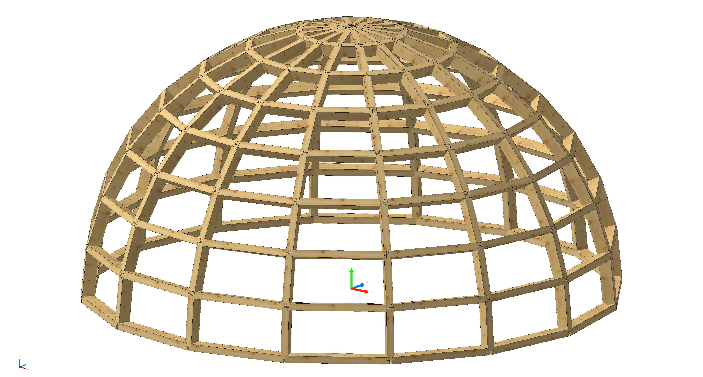

---
hide:
  - toc
---

# Packages

## COMPAS cadwork

COMPAS cadwork is an open-source Python package which allows you to harness the power of the COMPAS framework inside cadwork 3d.

<figure markdown="1">
{: style="width:700px"}
</figure>

Make use of COMPAS’ extensive geometry kernel, data structures, and algorithms to create, manipulate, and analyze your 3d models in cadwork. Gain access to the COMPAS ecosystem which includes a wide range of tools and libraries engineered for the AEC industry.

[GitHub COMPAS cadwork](https://gramaziokohler.github.io/compas_cadwork/latest/)